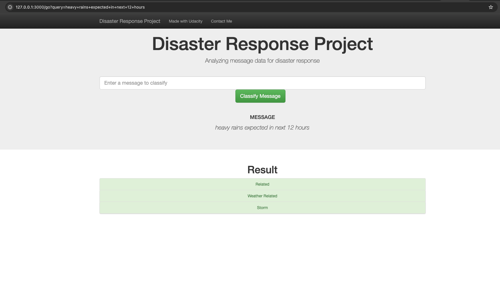

# Disaster Response Pipeline Project

In the event of a disaster natural or man-made, the trauma which the local people have to go through is immense. 
Additionally, there are several challenges for the people involved in the humanitarian efforts to keep account of the needs of the victims.
Hence, there is a need to efficiently organize the requests received by these people/organizations so that they can focus on catering towards the same in the shortest amount of time. 
This project aims at automating the categorizing of messages received on the event of a disaster. 
We propose a web application which uses a machine learning model trained of thousands of text messages usually received during a disater. 
The underlying model uses a multiclass classification to classify the messages across various categories such as 'food', 'water', 'medical_aid', and so on to name a few.
 

 
## Multiclass classification for classifying disaster response into appropriate categories.

Dataset Source: This dataset has been made available by [Appen](https://appen.com/)

### Key Components:
- ETL pipeline
- ML pipeline:
  - NLP based text processing.
  - Model building with hyper-parameter optimization.
- Flask based Web UI.

### Codebase structure:

+ udacity_ml_pipeline/
    + [app/](app/)
        + run.py - Flask web app main script.
        + [templates/](templates/)
            + go.html - Results Page on Form submission 
            + master.html - Home page
    + [data/](data/)
        + process_data.py  - ETL pipeline script 
    + [models/](models/)
        + train_classifier.py - ML pipeline script
          
          
### Steps to run the project:
1. Run the following commands in the project's root directory to set up your database and model.

    - To run ETL pipeline that cleans data and stores in database
        `python data/process_data.py data/disaster_messages.csv data/disaster_categories.csv data/DisasterResponse.db`
    - To run ML pipeline that trains classifier and saves
        `python models/train_classifier.py data/DisasterResponse.db models/classifier.pkl`

2. Go to `app` directory: `cd app`

3. Run your web app: `python run.py`

